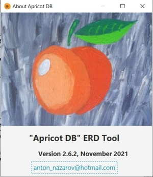

Preface
#######

About "Apricot DB"
******************

"Apricot DB" is a simple but powerful tool for the database design, based on Entity Relationship paradigm.
"Apricot DB" allows to design- analyse- script- and document the relational database.

"Apricot DB" has been developed for multiple roles existing in the IT- projects: analysts, database designers, developers, testers and business users. 

The modern database can include hundreds and even thousands of tables and relationships between them. Very often the structure of the database needs to be analysed, documented and altered.
"Apricot DB" was designed to support the big database structures from all popular providers, with high stability and performance.

The database structure is a set of tables, connected with each other by the relationships. 

.. note::
   The terms "tables" and "entities" have been used in this document as synonyms. 

A simple idea of the Entity Relationship Diagram lies at the background of the graphical representation of the database structure.

"Apricot DB" main functions
***************************

The main functions of "Apricot DB":

* create new or edit the existing database structures using the graphical editor;
* reverse engineer of the existing (physical) database into the ApricotDB Project; 
* compare different versions of the same database;
* generate the database scripts for different purposes: create/drop the tables, delete data, compare and modify different versions of the same database;
* import/export the projects from/to the local file. Export the diagrams into graphic format and PDF;
* synchronize the project with the remote Git based repository;
* generate the detailed Excel- report, which reflects all the entities, fields, constraints, indexes and relationships included into the database;
* store all database design information produced by the user in a well structured projects (the ApricotDB Project).

History of the Project
**********************

I've started "Apricot DB" in Augist 2018. It was growing from a little database utility, which was migrated in years through multiple designs, functionalities and the programming languages.

Since August 2018 "Apricot DB" uses Java and Spring Framework with graphical user's interface implemented on JavaFX. The project went through several major Releases.
I've been carefully checking the feedbacks recaived from the Users, implementing the bug fixes and the new features accordingly. 
At any moment of time "Apricot DB" has been compiled against the latest versions of Java Machine and includes the latest versions of the third party frameworks.

"Apricot DB" has the development site: http://apricotdb.co.za/. There are some thoughts regarding the application design and the project- history notes.

Where To Find "Apricot DB" on Internet
**************************************

Historically "Apricot DB" has been hosted on SourceForge.org: https://sourceforge.net/projects/apricot-db/. Here you can find the official project distributives.

The source code of "Apricot DB" can be found on GitHub: https://github.com/antonnazarov/apricot. The stable code has been contained in the master branch. 

The latest development version code can be found in branch release-x.x with the maximum index.

Installation
************

"Apricot DB" has been provided in two distributives: for MS Windows and for Linux.
In both cases it is enough to unzip the distributive archive and run the apricot.exe for Windows and the startup.sh script for Linux.
