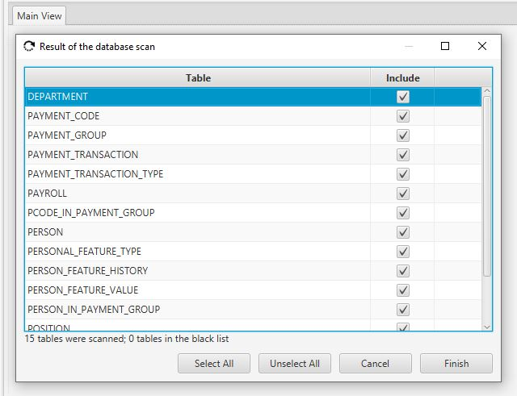

The Quick Start Guide
#####################

Here I provide several basic steps and techniques to start using the application.

One of the most demanded operation of any ERD tool is a reverse engineering process - reading of the structure of the existing database.
Below I present the user interface of "Apricot DB" with short definitions of all main areas it consists of, and then, a sequence of steps to reverse engineer some database.

The "Apricot DB" Interface
**************************

   The user interface of "Apricot DB"

The user interface of the application contains the following areas:

1. The main menu and selectors of the snapshot and scale;
2. The tool bar allows access to all major functions of "Apricot DB";
3. The search/filter of the entities in the current snapshot;
4. The Apricot views, which contain logical fragments of the whole ERD;
5. The project explorer, which contains a list of the entities in the current snapshot;
6. The entity relationship diagram editor;
7. The scaled Apricot map, which reflects the current diagram in the appropriate scale.

The Testing Database
********************

Before the reverse engineering exercise is started you need some testing database. 
The list of database types, currently supported by "Apricot DB" is shown below:

For most not file based databases you need to know the server and database name, port number, user name and password. If you use SQL Server, the current Windows credentials can be used.
Have this parameters before the reverse engineering is started.

Creating a new Project
**********************

In order to create a new Project, select Project/New item in the main menu.

   The form "Create a new Project"

The form requests a name for the new Project. Select the type of your testing database from the "Project Database" list. Leave the rest parameters by default. Click "Save".
The new Project will be created.

Running the Reverse Engineering process
***************************************

Click on the "Reverse Enginnering" toolbar button to run the Reverse Engineering process.

   The "Reverse Engineering" toolbar button

The Connect to the Database" form will be shown.

.. note::
   This form might be different depending on the target database type. 

Fill in the connection parameters of the target database and click "Forward". The scan of database will start.
If the scanning process finishes successfully, a list of all scanned database tables will be shown in the next form.

Click "Finish" fo finalize the Reverse Engineering process.
"Apricot DB" will ask if the alignment of the new ER diagram is required. Click "Align".

The new diagram will be aligned and shown. Any further alignment and editing might be done by the user in the Diagram Editor.

In general these was the shortest sequence of steps shown, to Reverse Engineer any existing database, supported by "Apricot DB" tool.
   