"Apricot DB" concepts
#####################

The Project, Snapshot and View
******************************

The Project is the top of the hierarchy of objects in "Apricot DB". Project contains the Snapshots and Views.

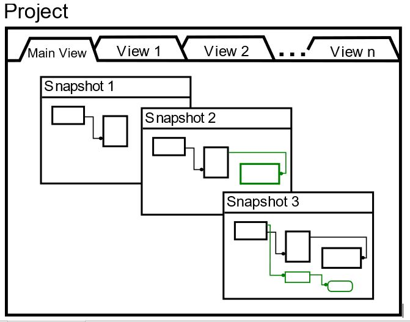

   The Snapshots and Views in the "Apricot DB" Project
  
The Entity-Relationship Diagram consists of Entities and Relationships between them.
The Snapshot contains the Entities and Relationships.
The View is responsible for the allocation of the Entites and Relationships on the Diagram.
The "Apricot DB" project can include multiple Snapshots and Views.

.. note::
   It is recommended to have a dedicated "Apricot DB" Project for each physical database.

The Snapshot
************

Each Snapshot represents one version of the existing (physical) database or the database being designed. 
For example, there might be several working environments, installed on the different servers, dedicated to 
different stages of development of the database: PROD, TEST, PRE-PROD and so on.
Each of these environments might be represented by one Snapshot.

Another example of use of the Snapshot might be the following. Let's assume, that you need to make some alteration(s) in the
existing database. The sequence of actions in "Apricot DB" might be the following:

#. reverse engineer the current version of the database into the new Snapshot. Let's name it: "Current Structure";
#. create a new Snapshot out of the "Current Structure". Name it "Altered DB Structure". After this step the two Snapshots, The "Current Structure" and the "Altered DB Structure" has been equal the "Altered DB Structure" was lust copied out of the "Current Structure";
#. make the requred alterations in "Altered DB Structure". Now the "Current Structure" and the "Altered DB Structure" have been different;
#. using the "Apricot DB" function "Compare Snapshots", the difference script might be automatically generated, which transforms the "Current Structure" into the "Altered DB Structure".
 
In order to create a new Snapshot, use the button on the toolbar: 

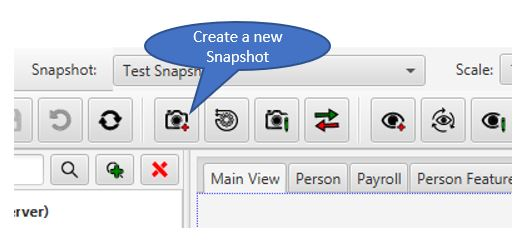

A new Snapshot needs an unique name.

The description is optional, but might collect important information about the Snapshot.

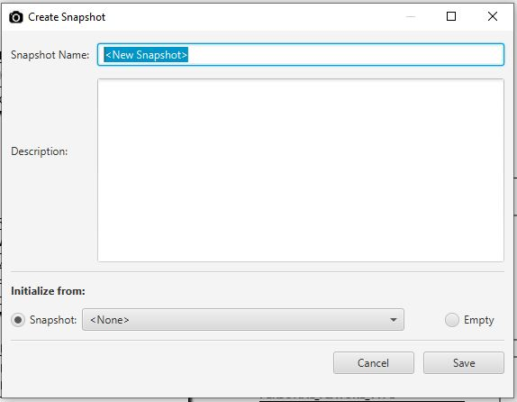

   The "Create a new Snapshot" Form
                    
The Snapshot can be created empty (no entites will be included into the new Snapshot), or as a copy of one of the existing Snapshots 
(see the "Initialize from" at the bottom of the form).

If the Project contains more than one Snapshot, the snapshot selector can be used to switch between different Snapshots, see the drop down 
list located next to the main menu:

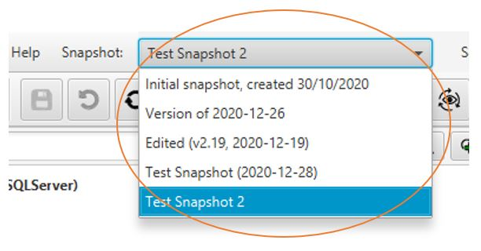

   The selector of the Snapshot

The currently selected Snapshots might be edited or deleted. The Snapshot menu is shown below:

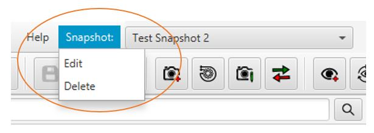

   The Snapshot menu

The View
********

A View in "Apricot DB" is an Entity Relationship Diagram, which contains a subset (or all) of entities of the current Snapshot.
There might be multiple Views created for the Project.
The Views of the Project have been shown as the tabs at the top of the canvas area. 
Initially, when the Project was just created, only one view exists - the "Main View".
The Main View always includes all objects of the current Snapshot.

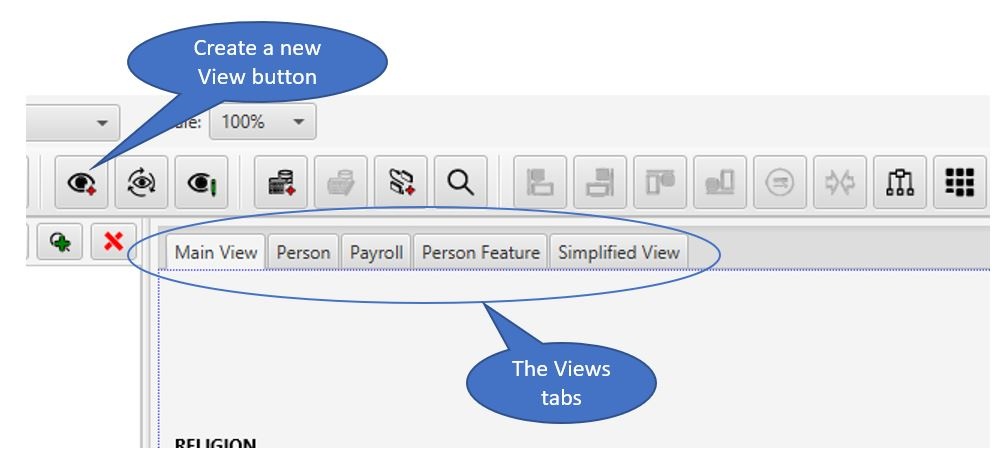

   The Apricot Views

.. note::
   The Main View always contains all objects of the current Snapshot. The content of the Main View is not editable, 
   which means that the Entities cannot be added/removed from the Main View. The Main View has been the first of the view tabs. 

The modern databases can contain hundreds and even thousands of entities and relationships between them. In case of such a big database structure it is almost impossible to
work with the only diagram, which includes all Entities. Therefore, "Apricot DB" allows to create extra "views" - the entity relationship diagrams, which contain only
limited subset of the entities of the database structure. Any particular Entity can be included into multiple Views.

A new View can be created using the button on the toolbar (see the screenshot above).

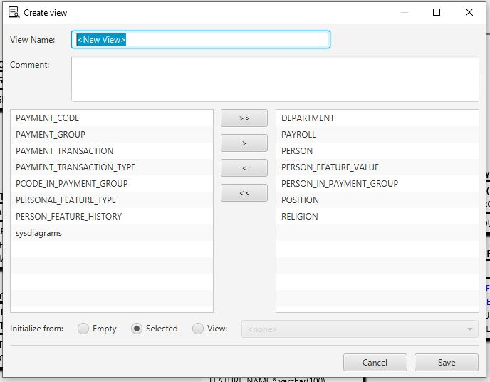

   Create a new Apricot View

In the form shown above a unique name of the new View needs to be filled.
The View has to include some Entities.
The list on the left side includes the Entities of the current Snapshot. Moving the Entities to the right, includes them into the new View.
If the current diagram has some Entities selected, by default "Apricot DB" will offer the initial list, which contains these selected Entities. 
The options "Initialize from" at the bottom of the form allow to initialize the content of the new View:

#. **Empty** - no Entities included into the View;
#. **Selected** - the Entities selected on the current diagram will be included;
#. **View** - all Entities of the selected existing View will be included.

The "Initialize from" choice might be changed at any moment during the creation of the new View. The view content list will be edited accordingly.

The Context Menus in "Apricot DB"
*********************************

The objects on Apricot DB diagrams or Project Explorer have the Context Menu, which can be activated by the right mouse button click. 
The Context Menu permits to access the essential functions/operations related to the selected object type (Canvas, Entity, Relationsip, multiple selected Entities and so on).

The Entity Context Menu
=======================

If an individual Entity is selected, the following Context Menu is shown:

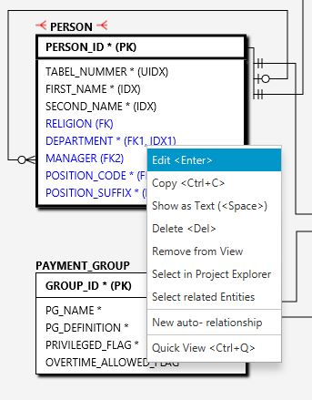

Here:

#. **Edit** - run the Edit Form of the selected Entity;
#. **Copy** - copies the selected Entity into the Clipboard;
#. **Show As Text** - shows the detailed information of the selected Entity as a text, which might be convenient for the copy/paste of the information;
#. **Delete** - delete the selected Entity;
#. **Remove from View** - removes the selected Entity from the current View, not deleting it from the Snapshot. *Note:* not available on the Main View;
#. **Select in Project Explorer** - finds and selects the Entity in the list of the Project Explorer (the left side of the application screen);
#. **Select Related Entities** - selects the Entities, which have been related to the current one. If the current View does not contain some related entities, the "Select Related Entities" form will be open;
#. **New auto- relationship** - runs the form of creation of new auto- Relationship. The **auto**- is a relationship which connects the selected Entity to itself;
#. **Quick View** - creates a new view (Quick View) which include the only Entity - the selected one.

The Context Menu when the multiple Entities selected
====================================================

When more than one Entity is selected (you can select multiple Entities with the left "Ctrl" button locked), the following context menu would be shown on the right mouse button:

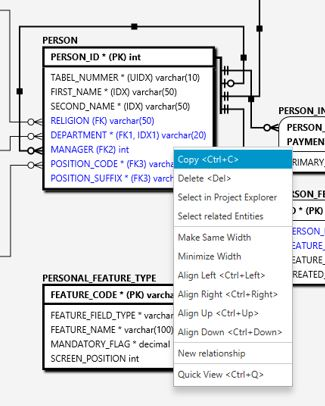

Here:

#. **Copy** - copies the selected Entities into the Clipboiard;
#. **Delete** - delete the selected Entities;
#. **Remove from View** - removes the selected Entities from the current View, not deleting them from the Snapshot. *Note:* not available on the Main View;
#. **Select in Project Explorer** - selects the Entities in the Project Explorer;
#. **Make Same Width** - make all selected Entities the same width (which would be the maximum width of all selected Entities);
#. **Minimize Width** - minimize width of all selected Entities;
#. **Align Left** - align the selected Entities as the most left Entity;
#. **Align Right** - align the selected Entities as the most right Entity;
#. **Align Up** - align the selected Entities as the most upper Entity;
#. **Align Down** - align the selected Entities as the most bottom Entity;
#. **New relationship** - if 2 Entites have been selected, the "New Relationship" form will be shown;
#. **Quick View** - creates a new view (Quick View) which include the selected Entities.

The Canvas Context Menu
=======================

If to right click in on the free field the diagram, the following Context Menu will be shown:

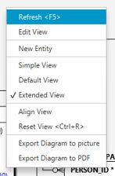

Here:

#. **Refresh** - re-draws the current ER- diagram/view, reading its current condition from the database;
#. **Edit View** - runs the form of editing of information of the current View, including the View's name, comment and the Entities included into the view. **Note:** a name and content of the "Main View" not editable. It is always names as "Main View" and includes all the Entities of the current Snapshot;
#. **New Entity** - runs the form of creation of the new Entity;
#. **Simple View** - turn the current diagram to reflect a minimum of the information: only Entity name, the Primary Key and the Relationships between Entities;
#. **Default View** - reflect the default Entity information, which includes all the fields names amd mandatory/optional option;
#. **Extended View** - in addition to the Default View shows the types and lengths (if any) of the fields;
#. **Align View** - runs the procedure of the automatic alignment of the Entities on the current Diagram;
#. **Reset View** - runs the simplest "matrix" allocation of the Entities on the current Diagram;
#. **Export Diagram to picture** - exports the current Diagram into the PNG- graphical format;
#. **Export Diagram to PDF** - exports the current Diagram into the PDF document;

The Project Explorer Context Menu
=================================

The Prohect item in the Project Explorer has the following Context Menu:

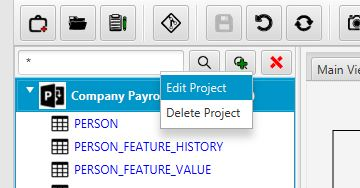

With this menu you can **Edit** or permanently **Delete** the current project.

The Entity Items of the Project Explorer have the Context Menu similar to the Entity one (see above).

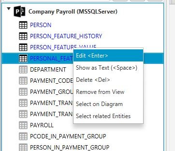

Here:

#. **Edit** - run the Edit Form of the selected Entity;
#. **Show As Text** - shows the detailed information of the selected Entity as a text, which might be convenient for the copy/paste of the information;
#. **Delete** - delete the selected Entity;
#. **Remove from View** - removes the selected Entity from the current View, not deleting it from the Snapshot. *Note:* not available on the Main View;
#. **Select on Diagram** - select the Entity on the current Diagram;
#. **Select Related Entities** - selects the Entities, which have been related to the current one. If the current View does not contain some related entities, the "Select Related Entities" form will be open;

The View Tab Context Menu
=========================

The View Tabs have the following Context Menu:

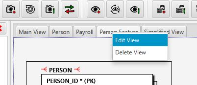

Here you can:

#. **Edit View** - edit the name, comment of the View as well as a set the Entities included into the View;
#. **Delete View** - request the permanent delete of the View.
