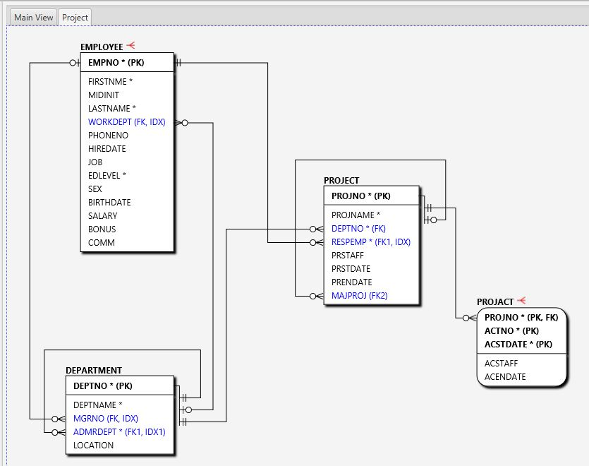

Projects and Snapshots in "Apricot DB"
######################################

Create a new Project
********************

By default, on the first run of the application, "Apricot DB"  contains a default Project, which contains one Snapshot and no Entities or Relationships.

It is recommended to create a dedicated Project for each database domain (or physical database) in your information system.

The Project should contain at least one Snapshot. A Snapshot represents one condition of the domain: current, historical or planned for implementation/modification.
The Snapshots of one Project can be compared between each other, using the function "Compare". This in turn, allows to analyse the changes made in the domain.
Another example of use of the multiple Snapshots is when the testing environment contains multiple testing environment. It is sometimes useful to have individual 
Snapshot for each testing environment, to be able co compare them.

Use Case: Automate Generation of the Structure Change Script 
************************************************************

An often task has been to make changes in the existing database structure.
For example, it was requested to make the following alteration in the database fragment below:

#. Add field DESCRIPTION (varchar/150) in the table DEPARTMENT;
#. Add a new table PROJECT_DETAIL, related to the table PROJECT(parent).

Assume we already have been created a Project and reverse engineered the current database structure into the empty Snapshot.
In order to make alterations in the database structure, the following sequence of steps is recommended in "Apricot DB":

#. Create a new Snapshot, where the requested alterations will be done.

I've called the new Snapshot "Release 2". In "Initialize From" I've selected the option "Snapshot" and selected the existing Snapshot "Reverse of the demo database".
All Entities and Relationships of the Snapshot "Reverse of the demo database" will be copied into the newly created "Release 2".

Then I've made requested changes in the database structure:

Now I have two Snapshots: the original one - "Reverse of the demo database", and one with the changes made: "Release 2":

In order to check the changes made and generate the alighnment script (the script which transforms the original database structure into the new one) I use the "Compare" function:

On the "compare" screen check "show differences only". Here the changes made have been shown:

To generate the alignment script use the "Generate Script" button:

.. figure:: figures/apricot-compare-generate.jpg
   :align: center

The generated script includes the changes made in the earlier steps of this example. The script can be saved as a file or copied direct into the preferred SQL-tool and applied on the testing environment.
In this way any two Snapshots contained in the Project can be compared.
