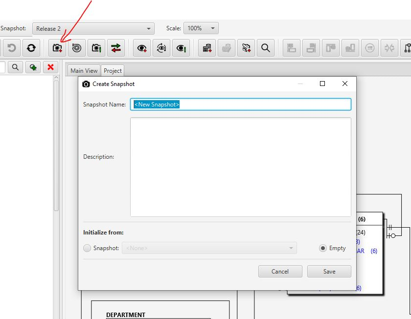

Reverse Engineering in "Apricot DB"
###################################

The Reverse Enginnering is one of the most often used function of "Apricot DB".
The Reverse Enginnering might be performed into the new (empty) Snapshot or into an existing one. 

The Reverse Engineering into an empty Snapshot
**********************************************

For Reverse Engineering (RE) of the source database from scratch, an empty Snapshot can be created in the current Project.

   The "Create new Snapshot" button on the Apricot toolbar

Put some name for the new Snapshot and optional Description. In the bottom part of form ("Initialize from") select the option "Emtpy". A new empty Snapshot will be created after "Save" button clicked. 

Start the Reverse Engineering process by clicking the RE- button on the toolbar:

